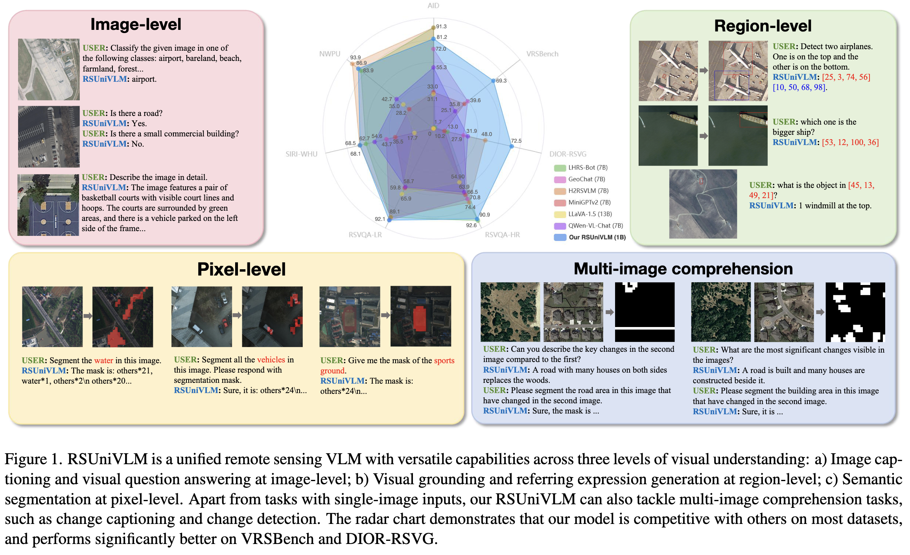

<div align="center">
<h1>RSUniVLM: A Unified Vision Language Model for Remote Sensing via Granularity-oriented Mixture of Experts</h1>

[]()
[]()
[]()
</div>

 

---
### 📢 Latest Updates

- **2024.12.8** Release demo code

---

### 🔨 Installation

1. Clone this repo: 
```
git clone git@github.com:xuliu-cyber/RSUniVLM.git
cd RSUniVLM
```

2. Install required Python packages

```
conda create -n rsunivlm python=3.11
conda activate rsunivlm
pip install --upgrade pip  # Enable PEP 660 support.
pip install -e ".[train]"
```

### 🖼️ Demo

In order to run an interactive demo on your own machine, execute the code:

```
python playground/botdemo.py
```

### 🎉 Acknowledgement

- **Code & Model**: We build our project based on the code repo of [LLaVA-NeXT](https://github.com/LLaVA-VL/LLaVA-NeXT).